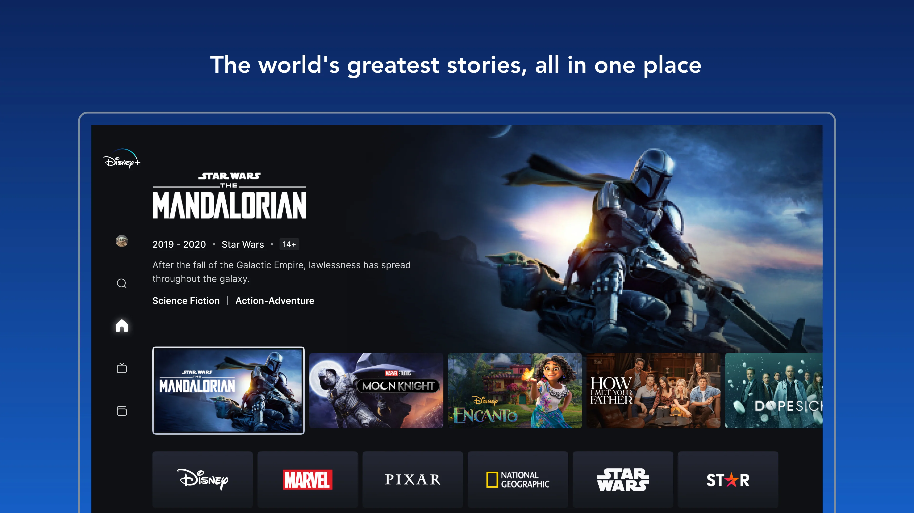
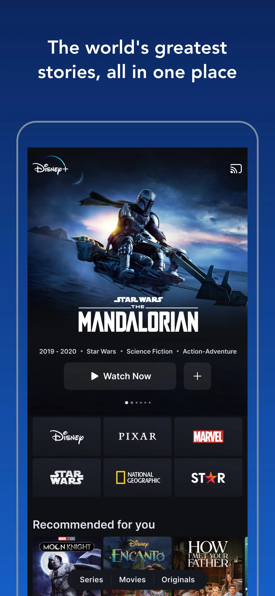
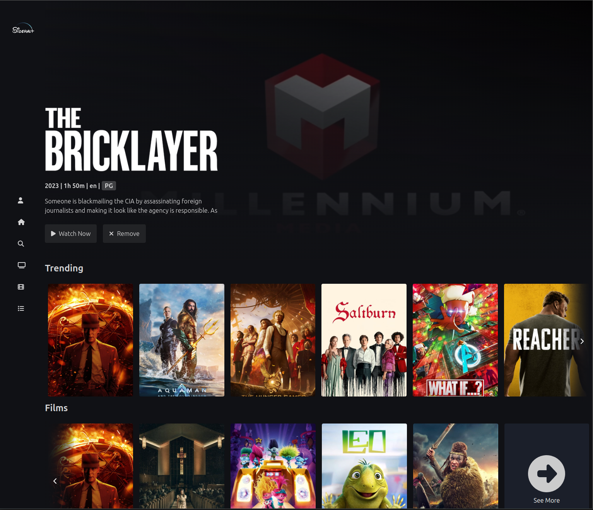
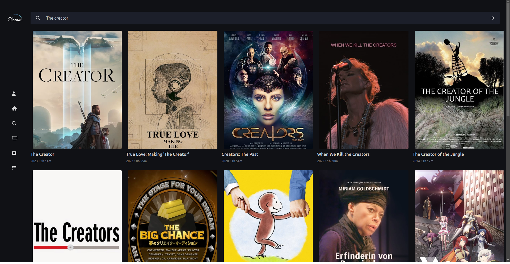
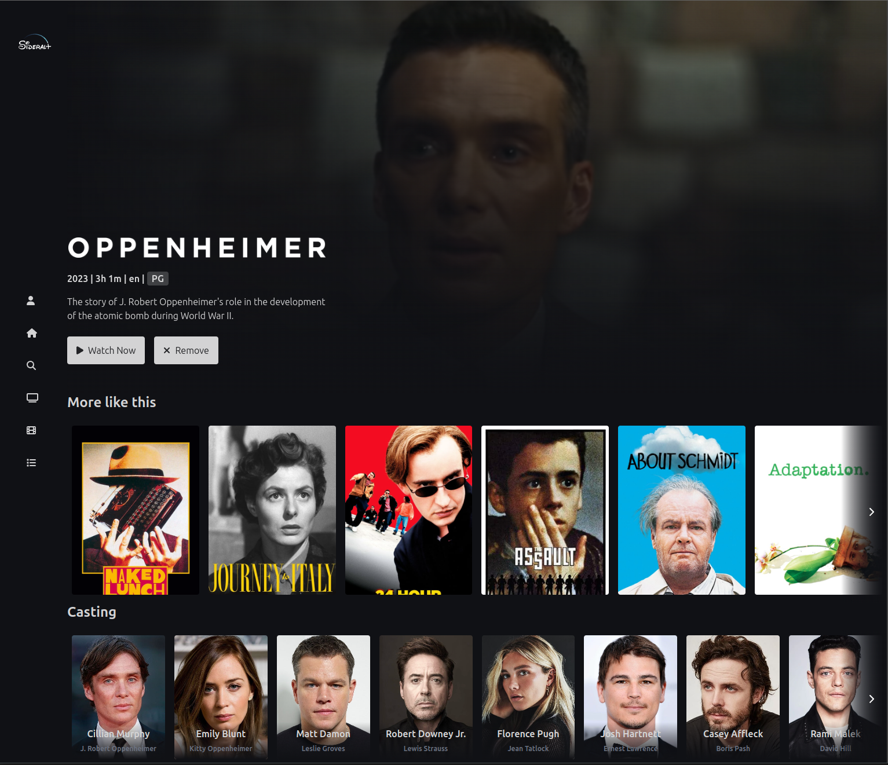
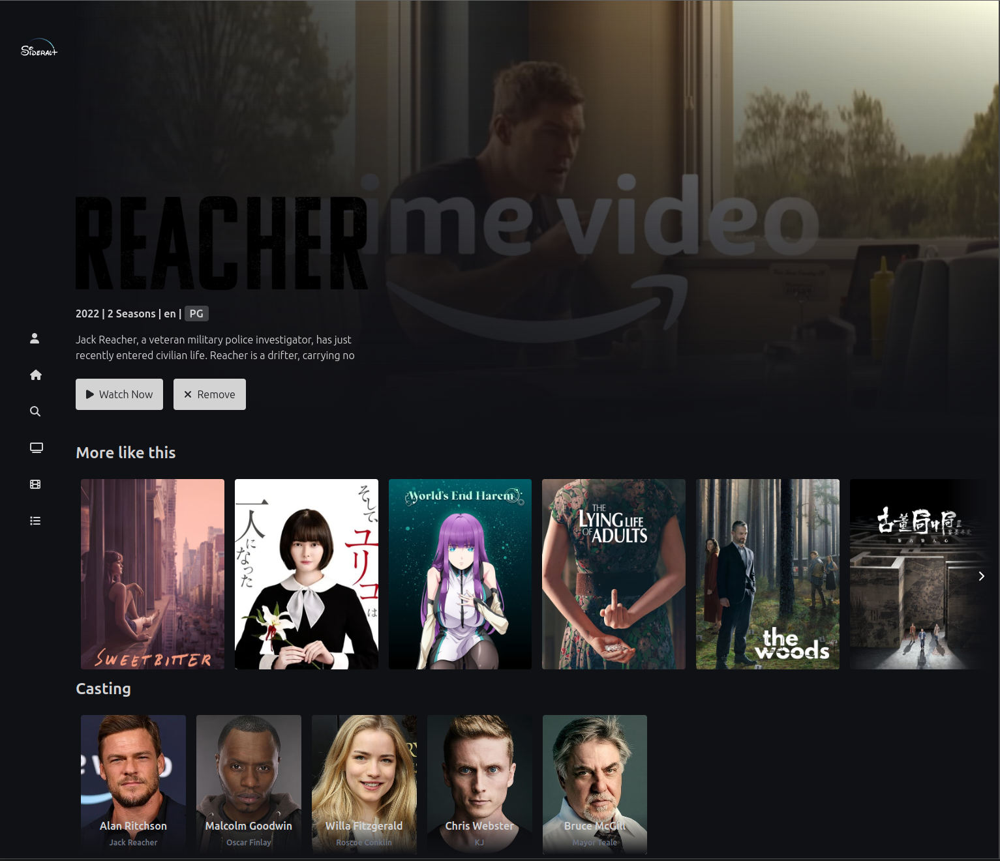
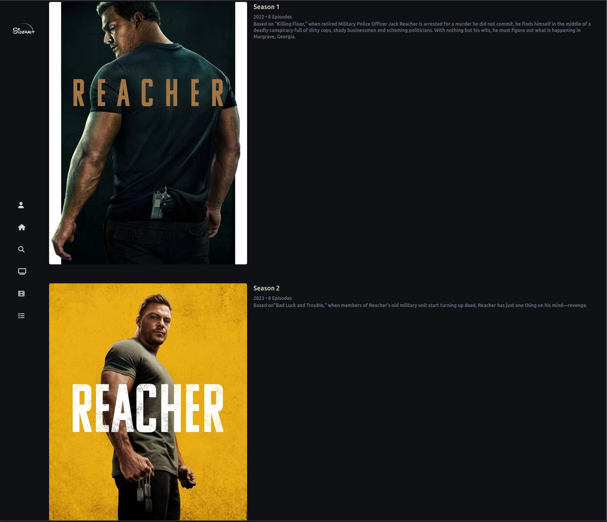
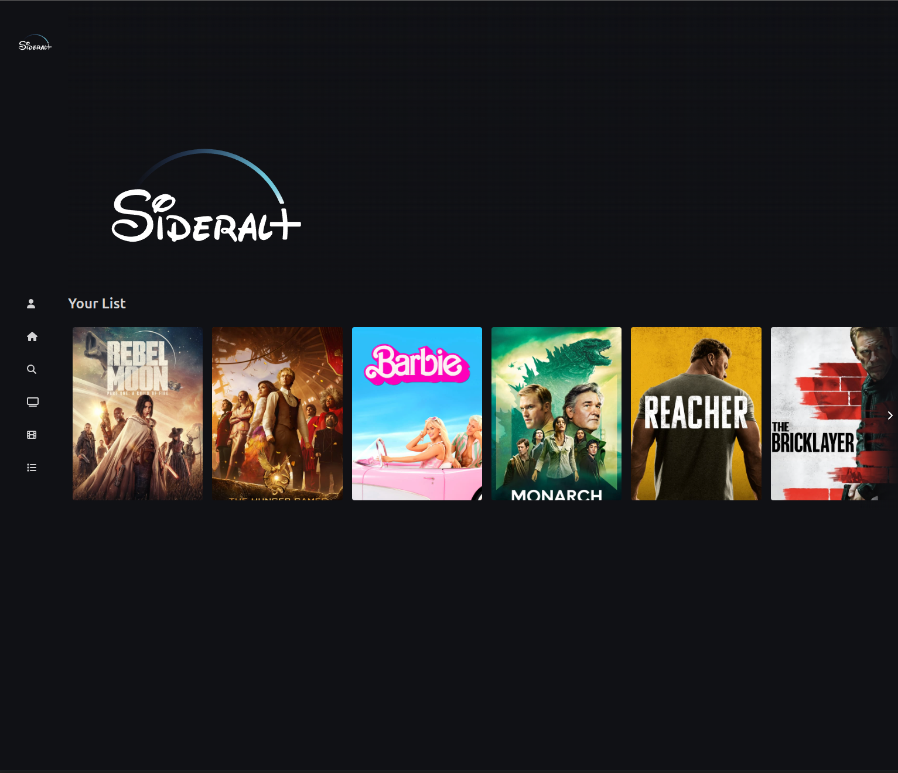
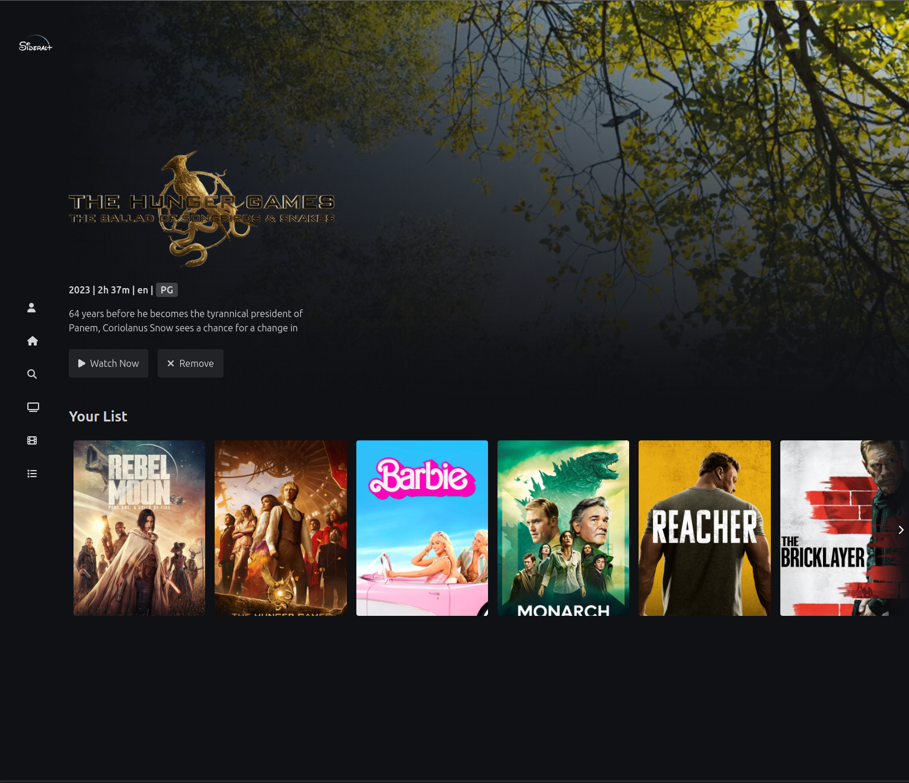

# SideralPlus


This project was generated with [Angular CLI](https://github.com/angular/angular-cli) version 16.2.10.

## Development server
before run the project, you need to install the dependencies, run `npm install` in the root folder of the project.
then you need to set up your environment variables. create a file called `.env` in the root folder of the project and add the following `.env.exemple` content:
```
# Data source
TMDB_API_KEY=""
TMDB_API_URL="https://api.themoviedb.org"
```

you can get your TMDB_API_KEY in [TMDB](https://www.themoviedb.org/documentation/api)


Run `ng serve` for a dev server. Navigate to `http://localhost:4200/`. The application will automatically reload if you change any of the source files.


## Why this design?
For this design I am inspired by Disney+ (old version of the app because for me its better than the new one) :
Picture used from [reddit](https://www.reddit.com/r/DisneyPlus/comments/uphzrh/disney_new_user_interface_coming_around_march//)



made using Tailwind CSS, fontawesome, The Movie DB API, Youtube API (angular module for the videos) and ngx-drag-scroll

## The content of the app
there is 3 main pages: (in the folder `src/app/pages`)
- Home page: where you can see the popular movies and tv shows
- Search page: where you can search for movies and tv shows
  - movies and series expend the search result if is movies or series
- Details page: where you can see the details of a movie or a tv show, the cast and the similar movies or tv shows (of its series you can see the seasons if there is registered in the api)
- My list page: where you can see the movies and tv shows that you have added to your list

(the header is a video if available or a picture of the movie / series)


## The components of the app
there is divided in 3 categories: (in the folder `src/app/components`)
- pages (the components called by the router module of angular)
- sections (the components that are used in the pages)
- utils (the components that are used in the sections)

## The services of the app
there is 3 services (in the folder `src/app/services`)
- data service: where you can find the methods to get the static data (sections of the home page)
- themovie service: where you can find the methods to get the movies data from the api
- user-storage service: where you can find the methods to get the user data from the local storage (to save the user list and add some interaction in the app)

## Peview of the app with explenation : 
### Home page
- the header show a YouTube video on background and some information of a trending movie / series
- on the trending section (form film) there is a card with ability to access to the search for more movies

### Search page
- only the search bar is visible
- when you scroll there load more results (if there is more) 


### Details page
- the header show a YouTube video on background and some information of the movie / series (possibility to add to the list (on the screen there is already added))
- on the similar section there is the similar movies / series of the movie / series
- on the cast section there is the cast of the movie / series



- For series its similar but there is the seasons list (when you scroll down) :



### My list page
- show all series previously added to the list (by default no one is selected). When you select one the data is displayed on the header and you stay on the same page. That able the user to see info for a movie / series and go back to the list.


selected : 



## Build

Run `ng build` to build the project. The build artifacts will be stored in the `dist/` directory.

## Running unit tests (not implemented yet)

Run `ng test` to execute the unit tests via [Karma](https://karma-runner.github.io).
